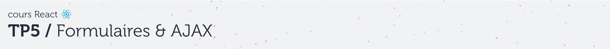
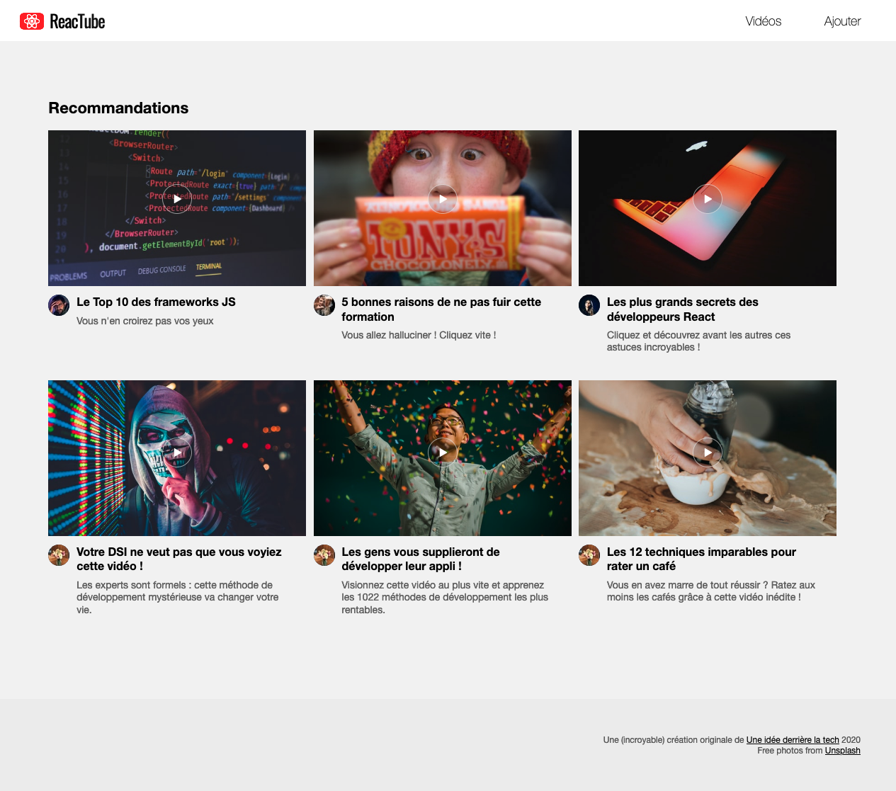

# A. Préparatifs <!-- omit in toc -->

Vous commencez maintenant à avoir l'habitude, je ne rentrerais donc pas dans les détails mais voici les différentes étapes pour le lancement du projet en mode [TL;DR](https://en.wiktionary.org/wiki/tl;dr)

**Attention** : La commande pour lancer la compilation et le serveur http a changé !
- **Ajoutez moi en tant que "reporter"**

1. **Tapez dans un terminal :**
	```bash
	mkdir ~/tps-react
	git clone https://github.com/GuillaumeCar/react-sujet-tp5.git ~/tps-react/tp5
	codium ~/tps-react/tp5
	```
2. **Puis dans un terminal intégré de VSCodium** (<kbb>CTRL/Cmd</kbd>+<kbd>J</kbd>) :
	```bash
	npm i
	npm start
	```

> _**NB :** si vous souhaitez plus de précisions sur les commandes précédentes et l'installation  / configuration du projet, vous pouvez vous référer au chapitre [A. Préparatifs](https://framagit.org/cours-react/tp2/-/blob/master/A-preparatifs.md) du TP2 ou simplement demander de l'aide au formateur_ 😄

Le résultat attendu est le suivant :



## Étape suivante <!-- omit in toc -->
Si tout fonctionne, vous pouvez passer à l'étape suivante : [B. serveur REST](B-serveur-rest.md)